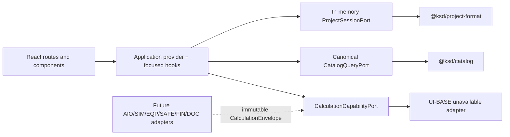

# Implementation Plan: Validated UI Foundation

**Branch**: `002-validated-ui-foundation` | **Date**: 2026-08-11 | **Spec**: `specs/002-validated-ui-foundation/spec.md`

## Summary

Replace the temporary foundation screen with a faithful autonomous port of the validated KYA SolDesign shell and desktop workflow. The port consumes canonical workspace contracts through explicit application services, starts with an empty in-memory project session, supports complete French and English UI-BASE copy, and renders every not-yet-built calculation as a typed unavailable state. It preserves the live light/`sober` design at revision `1be343f...` while excluding prototype fixtures, duplicated domain state, mock engines, experimental visual modes, persistence, and desktop packaging.

## Technical Context

**Language/Version**: TypeScript 7.0.2, React 19.2.8, Node.js ≥22.14
**Primary Dependencies**: React, React DOM, React Router DOM, `@ksd/domain`, `@ksd/catalog`, `@ksd/project-format`; no UI framework
**Storage**: In-memory session only; no database/browser persistence in this feature
**Testing**: Vitest, Playwright, Playwright visual snapshots, fast static/import-boundary checks, accessibility automation
**Target Platform**: Desktop-class evergreen browser through Vite; Tauri later
**Project Type**: pnpm workspace with a React/Vite application and shared TypeScript packages
**Performance Goals**: shell/navigation interactions respond within one animation frame after data is present; catalog filtering remains responsive for the current canonical snapshot; no avoidable layout shift after initial route render
**Constraints**: autonomous repository; no parent runtime dependency; no production calculation; no fixture results; FR/EN complete; 1440×1000 reference and 1024×768 constrained desktop
**Scale/Scope**: 6 system cards, 4 top-level destinations, 8 workshop steps, shared shell/dialog/palette/state primitives, canonical equipment browse, 2 locales

## Constitution Check

### Before Phase 0

| Principle | Gate | Result |
|---|---|---|
| Truthful calculations only | No result UI without immutable production evidence | PASS — production adapter is unavailable-only |
| Pure TypeScript core | React does not implement formulas or call a prototype engine | PASS |
| Units/provenance/traceability | Catalog uses canonical contracts; future ready state requires `CalculationEnvelope` | PASS |
| Test-first assurance | Truth-state, i18n, route, a11y, visual, and boundary tests precede/drive each slice | PASS |
| Autonomous green gates | `verify:phase` after every phase; no red continuation | PASS |
| Independent/migration-safe | Parent source is audit-only; no runtime path or implicit legacy storage migration | PASS |
| Scope/deletion | Experimental styles, mock engine, fixture stores, timestamp truth, and unused variables are excluded | PASS |

### After Phase 1 design

- No database or persistence choice introduced.
- No new calculation package or formula introduced.
- Application ports stay app-local until a second consumer proves extraction.
- Visual scenario fixtures are test-only and protected by import-boundary tests.
- French and English are both acceptance requirements.

**Result**: PASS. No constitution exception or complexity waiver is required.

## Architecture



### State ownership

- `ApplicationProvider`: cross-route locale, theme, project collection/current id, stable service bindings.
- Feature components: filters, open tabs, dialog draft fields, and other transient interaction state.
- `ProjectFileV1`: canonical session draft, replaced through a typed project port.
- Future calculation runs: immutable, separate from the editable draft, never stored as timestamps in UI state.

### Dependency rules

1. `app/` composes routes/providers and may import all app features.
2. `features/` may import `shared/`, application contracts, and workspace packages; features do not import each other except through explicit public modules.
3. `shared/` may not import feature modules.
4. Components never import canonical JSON files, parent paths, test scenarios, or engine implementations.
5. Production entry points never import `test/`, `e2e/`, or scenario builders.

## Project Structure

### Documentation

```text
specs/002-validated-ui-foundation/
├── spec.md
├── plan.md
├── research.md
├── source-inventory.md
├── data-model.md
├── quickstart.md
├── contracts/
│   ├── application-ports.md
│   ├── i18n.md
│   └── visual-acceptance.md
├── reference-captures/
│   ├── README.md
│   └── *-live.png
├── checklists/
│   ├── requirements.md
│   └── visual.md
└── tasks.md
```

### Source code

```text
apps/desktop/
├── src/
│   ├── app/
│   │   ├── App.tsx
│   │   ├── router.tsx
│   │   ├── ApplicationProvider.tsx
│   │   ├── contracts.ts
│   │   ├── adapters/
│   │   │   ├── inMemoryProjects.ts
│   │   │   ├── canonicalCatalog.ts
│   │   │   └── unavailableCalculations.ts
│   │   └── shell/
│   │       ├── TopBar.tsx
│   │       ├── StatusBar.tsx
│   │       └── CommandPalette.tsx
│   ├── features/
│   │   ├── home/
│   │   ├── projects/
│   │   ├── catalog/
│   │   ├── settings/
│   │   ├── workshop/
│   │   │   └── steps/
│   │   └── dossier/
│   ├── shared/
│   │   ├── a11y/
│   │   ├── i18n/
│   │   ├── status/
│   │   └── ui/
│   ├── assets/systems/
│   ├── styles/
│   └── main.tsx
├── test/
│   ├── unit/
│   ├── integration/
│   └── support/
└── e2e/
    ├── navigation.spec.ts
    ├── truth-states.spec.ts
    ├── i18n.spec.ts
    ├── accessibility.spec.ts
    ├── responsive.spec.ts
    └── visual.spec.ts

tools/
└── ui/
    ├── check-production-boundaries.mjs
    └── check-i18n.mjs
```

**Structure Decision**: Keep the application boundary inside `apps/desktop` because there is one UI consumer. Reuse existing domain/catalog/project packages and extract a new workspace package only when a second runtime consumer proves the need.

## Delivery Phases

### Phase 1 — Test and architecture guardrails

- Lock live visual authority and difference ledger.
- Add routing/i18n/accessibility dependencies and test commands.
- Create typed application ports, unavailable adapter, and production-import scans.
- Establish test-only scenario injection.
- Gate with contract/unit tests and `pnpm verify:phase`.

### Phase 2 — Tokens, shared UI, and shell

- Port approved token system and six schematic assets.
- Implement shell, palette, dialogs, notifications, state primitives, focus management, and localized copy.
- Add FR/EN key completeness and shell visual/a11y coverage.
- Gate before routes.

### Phase 3 — Home, projects, catalog, settings

- Implement empty/session-only project journeys and six system cards.
- Implement canonical catalog browse/search/provenance.
- Implement locale/theme settings without persistence/offline claims.
- Test FR/EN, empty/error states, keyboard navigation, and visual parity.
- Gate before workshop.

### Phase 4 — Workshop and dossier skeleton

- Implement project guard and eight-step rail.
- Port non-calculated input intent only where canonical contracts exist.
- Render typed unavailable states for all calculation-dependent panels/tabs.
- Add route recovery, keyboard, responsive, truthfulness, and visual tests.
- Gate before final hardening.

### Phase 5 — Acceptance and convergence

- Run forbidden-pattern/bundle scans, accessibility, 1024 desktop, 200% text, both locales, and visual review.
- Complete difference ledger and traceability matrix.
- Run `pnpm verify`, `$ksd-ui-acceptance`, and `$speckit-converge` until green.
- Mark UI-BASE-001 done only after evidence is recorded.

## Test Strategy

| Layer | Evidence |
|---|---|
| Unit | reducer/selectors, capability-state invariants, translations, filters, formatting |
| Contract | application adapters satisfy interfaces and canonical parsing boundaries |
| Integration | project creation/session flow, route guards, locale preservation, catalog errors |
| E2E | primary keyboard journeys, dialogs/palette, empty/unavailable/error states |
| Accessibility | semantic roles/names, focus order/trap/restore, live regions, non-color state |
| Responsive | 1440×1000, 1024×768, 200% text, no document-level horizontal scroll |
| Visual | source-reference comparisons plus approved difference ledger |
| Boundary | source and built output contain no parent/mock/fixture/test imports |

## Complexity Tracking

No constitution violations. No extra package, database, state framework, or compatibility layer is introduced.
